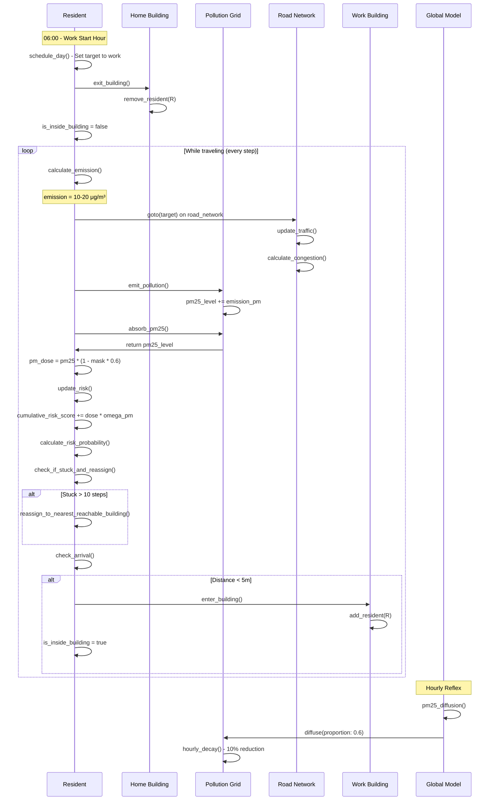
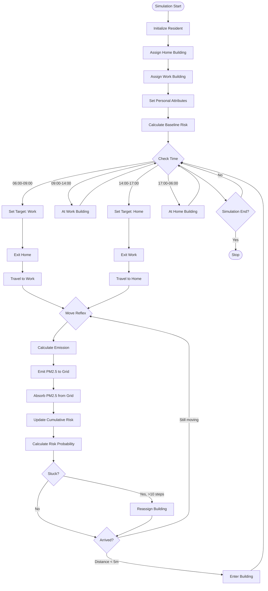
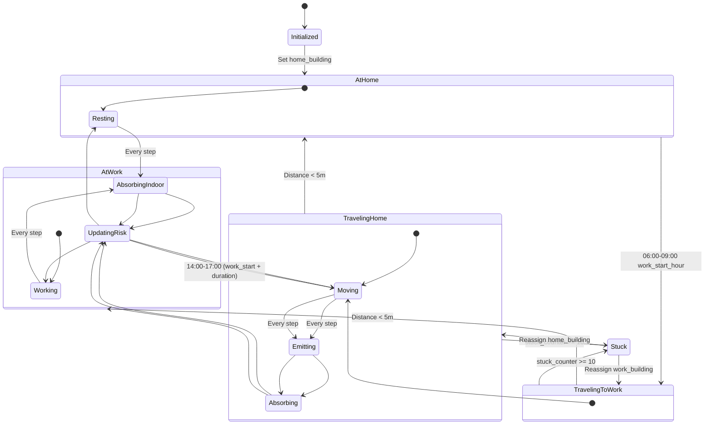
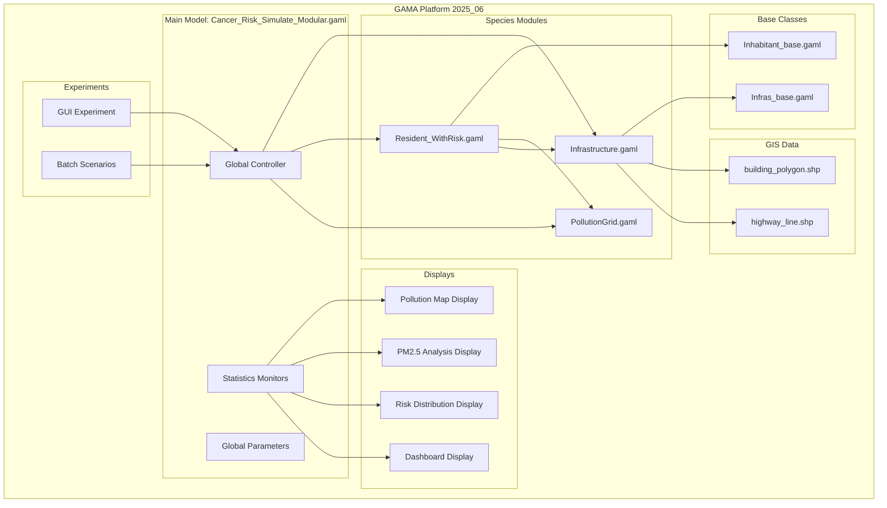
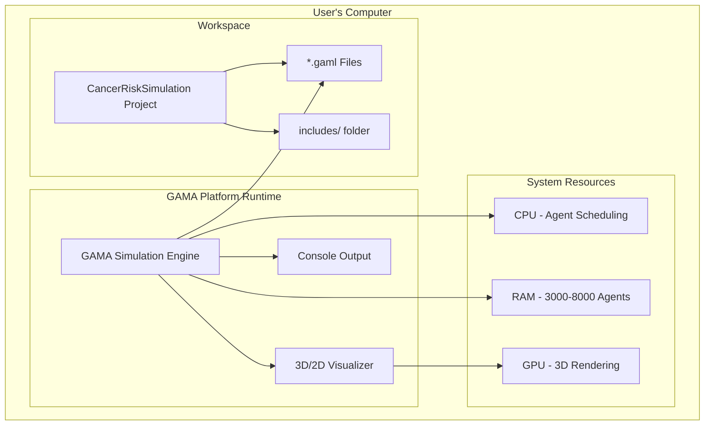
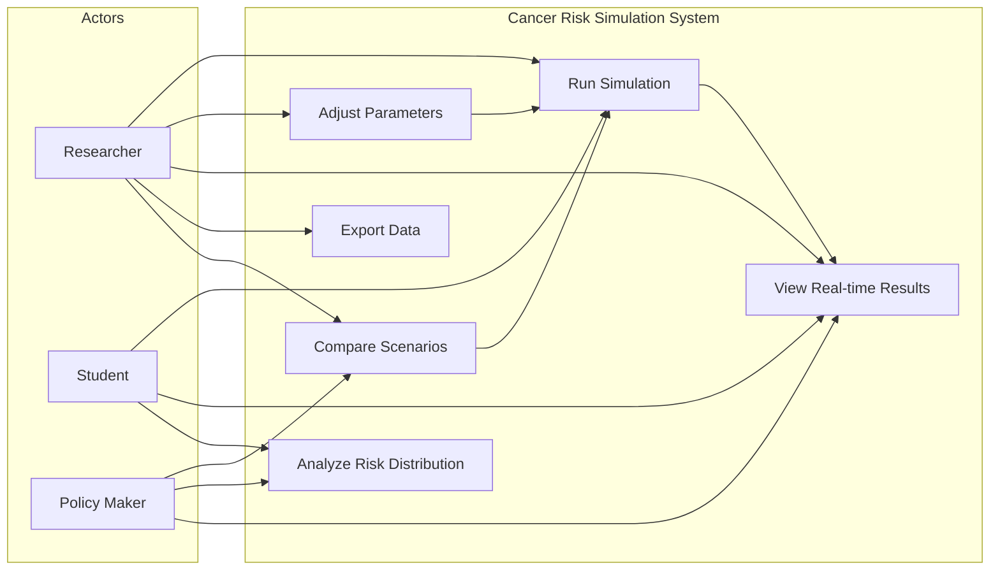
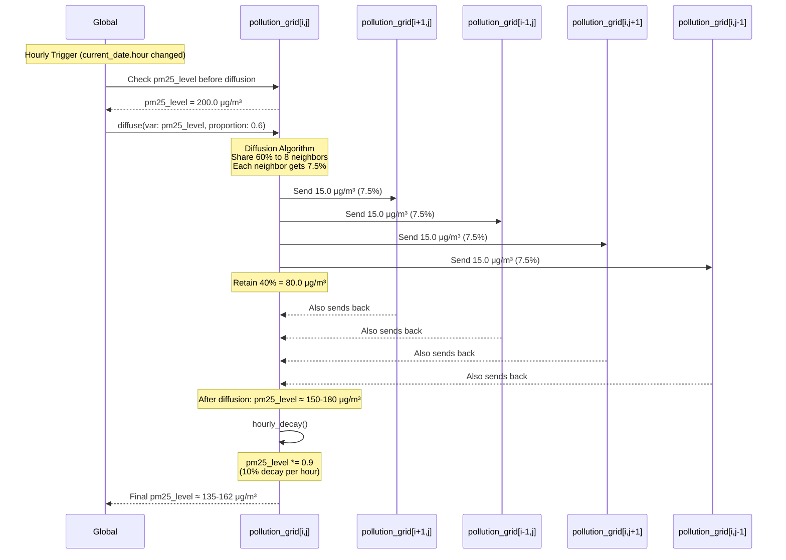
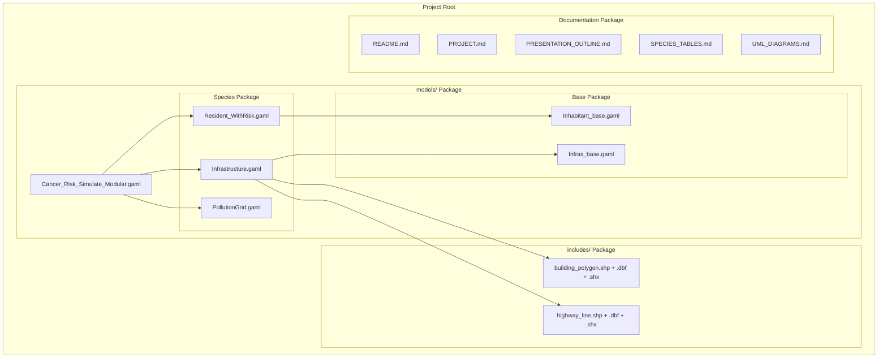

# UML Diagrams - Cancer Risk Simulation

Comprehensive UML diagrams for the Agent-Based Model of PM2.5 Exposure and Cancer Risk.

---

## 1. Class Diagram - Species Architecture

```mermaid
classDiagram
    class Building {
        -string type
        -int capacity
        -list~Resident~ residents_inside
        -geometry shape
        +add_resident(Resident r)
        +remove_resident(Resident r)
        +get_resident_count() int
        +is_available() bool
    }

    class Road {
        -float speed_rate
        -float congestion_level
        -int traffic_count
        -geometry shape
        -rgb color
        +update_traffic()
        +update_color()
        +calculate_congestion() float
        +get_weight() float
    }

    class Resident {
        -bool is_male
        -bool is_smoke
        -bool is_obese
        -bool is_family_history
        -bool is_wearmask
        -Building home_building
        -Building work_building
        -Building current_building
        -point target
        -float speed
        -float emission_pm
        -float base_emission_rate
        -float pm_dose
        -float baseline_risk
        -float cumulative_risk_score
        -float risk_probability
        -bool is_inside_building
        -int work_start_hour
        -int work_duration
        -int stuck_counter
        -int reassignment_count
        +initialize_attributes()
        +schedule_day()
        +move()
        +calculate_emission()
        +emit_pollution()
        +absorb_pm25()
        +update_risk()
        +enter_building(Building b)
        +exit_building()
        +check_if_stuck_and_reassign()
        +get_risk_color() rgb
    }

    class PollutionGrid {
        -float pm25_level
        -float grid_value
        -int last_decay_hour
        -rgb color
        +hourly_decay()
        +get_pm25_color() rgb
    }

    class Global {
        -int initial_population
        -float resident_speed
        -float emission_multiplier
        -float mask_effectiveness
        -float omega_pm
        -float PM_ref
        -graph road_network
        -map road_weights
        +initialize_buildings()
        +initialize_roads()
        +initialize_residents()
        +initialize_network()
        +pm25_diffusion()
        +update_road_weights()
    }

    Resident "0..*" --> "1" Building : home_building
    Resident "0..*" --> "1" Building : work_building
    Resident "0..1" --> "0..1" Building : current_building
    Resident --> "1" PollutionGrid : absorbs from
    Resident --> "1" PollutionGrid : emits to
    Resident --> Road : travels on
    Building "1" --> "0..*" Resident : contains
    Road --> Global : updates weights
    PollutionGrid --> PollutionGrid : diffuses to neighbors
    Global --> Building : manages
    Global --> Road : manages
    Global --> Resident : manages
    Global --> PollutionGrid : manages
```



---

## 2. Sequence Diagram - Morning Commute Flow



---

## 3. Activity Diagram - Resident Daily Cycle



---

## 4. State Diagram - Resident Behavior States



---

## 5. Component Diagram - System Architecture



---

## 6. Deployment Diagram - Runtime Environment



---

## 7. Use Case Diagram - User Interactions



---

## 8. Object Diagram - Runtime Example (8 Hours Simulation)

```
┌─────────────────────────────────────────────────────────────┐
│                     Global Model State                       │
│  cycle: 480 (8 hours × 60 steps/hour)                       │
│  current_date: 14:00 (2 PM)                                  │
│  avg_pm25: 142.5 μg/m³                                       │
│  avg_risk_probability: 0.157 (15.7%)                         │
└─────────────────────────────────────────────────────────────┘
                            │
        ┌───────────────────┼───────────────────┐
        │                   │                   │
        ▼                   ▼                   ▼
┌──────────────┐    ┌──────────────┐    ┌──────────────┐
│ resident#0   │    │ resident#1   │    │ resident#2   │
├──────────────┤    ├──────────────┤    ├──────────────┤
│ is_male: T   │    │ is_male: F   │    │ is_male: T   │
│ is_smoke: T  │    │ is_smoke: F  │    │ is_smoke: T  │
│ is_obese: F  │    │ is_obese: T  │    │ is_obese: F  │
│ is_wearmask:T│    │ is_wearmask:T│    │ is_wearmask:F│
├──────────────┤    ├──────────────┤    ├──────────────┤
│baseline: 0.9 │    │baseline: 0.6 │    │baseline: 0.9 │
│cum_risk: 3.2 │    │cum_risk: 2.1 │    │cum_risk: 4.7 │
│risk_prob:0.21│    │risk_prob:0.14│    │risk_prob:0.31│
├──────────────┤    ├──────────────┤    ├──────────────┤
│state: travel │    │state: travel │    │state: AtWork │
│location: Road│    │location: Road│    │location: Bldg│
└──────┬───────┘    └──────┬───────┘    └──────┬───────┘
       │                   │                   │
       │ emits_to          │ emits_to          │ inside
       ▼                   ▼                   ▼
┌──────────────┐    ┌──────────────┐    ┌──────────────┐
│pollution#245 │    │pollution#312 │    │ building#42  │
├──────────────┤    ├──────────────┤    ├──────────────┤
│pm25_level:   │    │pm25_level:   │    │ type: work   │
│  187.3 μg/m³ │    │  201.5 μg/m³ │    │ capacity: 50 │
│color: #FF3E00│    │color: #FF1A00│    │ residents: 38│
│  (Red-Orange)│    │  (Deep Red)  │    │              │
└──────────────┘    └──────────────┘    └──────────────┘
```

---

## 9. Interaction Diagram - PM2.5 Diffusion Process



---

## 10. Package Diagram - Code Organization



---

## 11. Data Flow Diagram - Risk Calculation Pipeline

```mermaid
flowchart LR
    subgraph Input
        Personal[Personal Attributes:<br/>gender, smoke, obese,<br/>family_history, mask]
        Environment[Environmental Data:<br/>PM2.5 grid levels]
        Location[Location State:<br/>indoor/outdoor,<br/>building/road]
    end

    subgraph Processing
        Baseline[Calculate Baseline Risk:<br/>baseline_risk = Σ(risk_factors)]
        Exposure[Calculate PM Exposure:<br/>pm_dose = pm25 × theta × (1-mask)]
        Accumulation[Accumulate Risk:<br/>cumulative_risk += dose × omega_pm]
        Sigmoid[Apply Sigmoid Function:<br/>P = 1/(1+exp(-k(cum+base)+b))]
    end

    subgraph Output
        Risk[Risk Probability:<br/>0.0 - 1.0]
        Category[Risk Category:<br/>Low/Medium/High/VeryHigh]
        Color[Visualization:<br/>Green/Yellow/Orange/Red]
    end

    Personal --> Baseline
    Environment --> Exposure
    Location --> Exposure

    Baseline --> Sigmoid
    Exposure --> Accumulation
    Accumulation --> Sigmoid

    Sigmoid --> Risk
    Risk --> Category
    Risk --> Color
```

---

## How to Use These Diagrams in Your Presentation

### Slide Recommendations:

1. **Slide 4 (Architecture)**: Use **Component Diagram** (#5) - Shows overall system structure
2. **Slide 5 (Species Overview)**: Use **Class Diagram** (#1) - Shows all species and relationships
3. **Slide 6 (Simulation Flow)**: Use **Activity Diagram** (#3) - Shows resident daily cycle
4. **Slide 7 (Mathematical Model)**: Use **Data Flow Diagram** (#11) - Shows risk calculation pipeline
5. **Slide 11 (Live Demo)**: Use **Sequence Diagram** (#2) - Explain what happens during commute

### Printing Tips:

- Export as PNG/SVG using Mermaid Live Editor: https://mermaid.live/
- Use landscape orientation for wider diagrams
- Print Class Diagram on A3 paper if possible
- For the presentation, show 2-3 key diagrams maximum (don't overwhelm)

### Code Rendering:

These diagrams use **Mermaid** syntax which renders in:
- GitHub (automatic)
- VSCode (with Mermaid extension)
- PowerPoint (copy as image from Mermaid Live)
- GAMA Documentation (if exported as images)

### Quick Reference:

| Diagram Type | Best For | Complexity |
|--------------|----------|------------|
| Class (#1) | Species structure | ★★★★☆ |
| Sequence (#2) | Step-by-step flow | ★★★★★ |
| Activity (#3) | Daily routine | ★★★☆☆ |
| State (#4) | Resident states | ★★★☆☆ |
| Component (#5) | System overview | ★★☆☆☆ |
| Data Flow (#11) | Risk calculation | ★★★☆☆ |

**Recommendation for 15-min presentation**: Show Component (#5), Class (#1), and Data Flow (#11) only.
